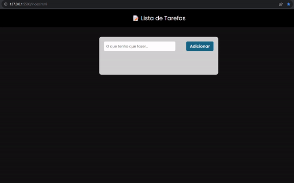

# 📋 To Do List 👨‍💻

## ℹ️ Sobre o Projeto
To-Do List que permite o usuário gerenciar tarefas.

Aplicação simples que visa consolidar conhecimentos em `JavaScript` e `manipulação na DOM`. As novas tarefas inseridas fiam armazenado em memória.

🔗 Acesse o Projeto Finalizado: https://joseweverton.github.io/toDo_List

## 🛠️ Tecnologias Utilizadas
- HTML5
- CSS3
- JavaScript

<h2>🚀 Funcionalidades</h2>

#### Adicionar nova tarefa:

Os usuários podem adicionar novas tarefas, fornecendo uma descrição.

#### Marcar tarefa como concluída:
 
As tarefas podem ser marcadas como concluídas no icone correspondente.

#### Excluir tarefa:

As tarefas concluídas ou indesejadas podem ser excluídas clicando no icone de exclusão.

#### Editar tarefa:

É possivel editar tarefas clicando no icone de edição.

<h3 align=center>🎬 Demonstração:</h3>

    

